# Coding Standards at Catenamedia/Hyperion
This document defines coding standards that is going to be utilized when writing PHP, JavaScript, Css code at Catenamedia.

## What's covered with this document?
* Definition of coding standards for each language
* How to use standards with legacy code
* Instructions how to add CodeSniffer and Linters
* Config files

### PHP Coding standards

#### Coding style, formatting, and naming

Coding standards for all PHP code written at Catenamedia should follow PSR-1 and PSR-12 standards. The list of things that should be compliant to PSR standards:
* PHP Tags
* Character encoding
* Code lines and indenting
* Namespaces and auto-loading
* Class, constants, properties, and methods naming
* Keywords and types
* Usage of traits
* Closures
* Methods and functions
* Control structures (if, switch, while, for, foreach, try-catch)
* Ternary operators

Complete standards can be found here:
* https://www.php-fig.org/psr/psr-1/
* https://www.php-fig.org/psr/psr-12/

### JavaScript and CSS Coding Standards {#custom-id}
Coding standards for all JavaScript and CSS code written at Catenamedia should follow WordPress Coding Standards (WP CS)   
https://make.wordpress.org/core/handbook/best-practices/coding-standards/javascript/   
https://make.wordpress.org/core/handbook/best-practices/coding-standards/css/   
With following exception:   
1. Wordpress Coding Standards (WP CS) recommends using TABS instead of SPACES for INDENTATION, we should ALWAYS USE SPACES
2. Declaring Variables with `const` and `let` It's very recommended to use syntax ES2015 or newer and if possible refactor legacy code.
3. CSS Property Ordering. In WP CS no strict recommendation about Property Ordering there's only recommendation to write it logical or grouped ordering.   
Since we gonna use Stylelint and Prettier will have strict order of the properties. it can be found in .stylelint config below.
4. CSS Media Queries. In WP CS   
"It is generally advisable to keep media queries grouped by media at the bottom of the stylesheet."   
But because of using SCSS Media Queries should be used inside selector to which it belongs.

### How to use standards with legacy code
After you will add all configs for Code Standards and Sniffer/Linters(instructions below) you will probably have bunch
of errors in bunch of files. Your working process will be next:   
When you star start working on a file, you need to run this file with auto fix Sniffer/Linter then fix manually all errors
that cannot be fixed automatically. Then make a separate commit of this file.

### CodeSniffer and Linters 

To help following all standards we will use CodeSniffer and Linters to check code and fix elementary mistakes

#### Editorconfig
Add `.editorconfig` file to root of your project and enable editorconfig plugin in IDE or editor that you use.   
In VSCode go to Extensions search for EditorConfig -> install it   
   
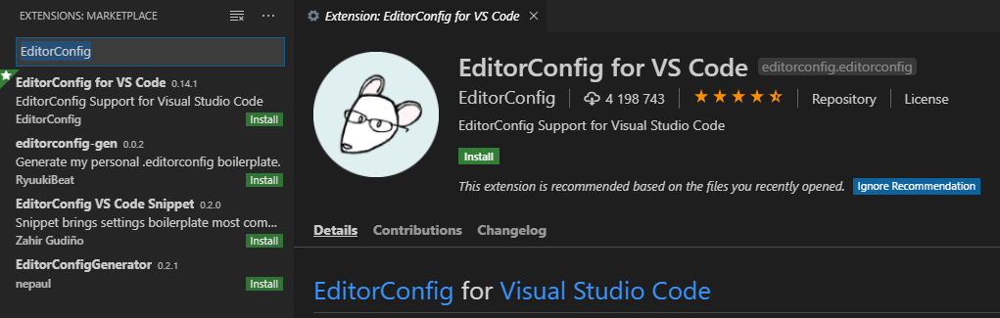   
   
In PHP Storm go to Settings -> Plugins search for EditorConfig and enable or install   
   
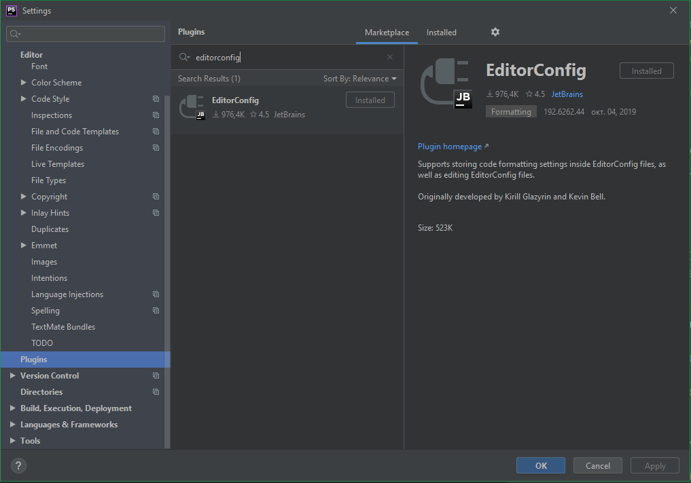   

#### PHP Code_Sniffer
Add `composer.json` to the root of you project and run in console `composer install`.   

##### PHPStorm
In PHPStorm be sure that executable path to PHP Code Sniffer and Code Beautifier is set up correctly   
Go to Settings -> Languages & Frameworks -> PHP -> Quality Tools -> Code Sniffer   
Should be set to `<YOUR_PROJECT>\vendor\squizlabs\php_codesniffer\bin\phpcs.bat and phpcbf.bat`   
   
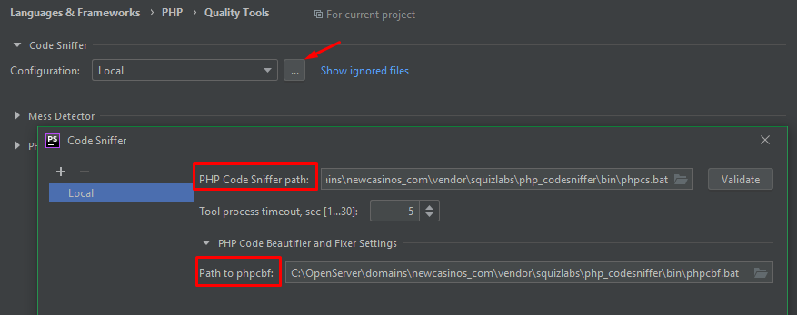   
Then Go to Settings -> Editor -> Inspections -> Quality Tools -> Enable PHP Code Sniffer Validation   
Severity - se to Errors   
In All Scopes you need to change Edit Scope order and add new where you have to select all files that do not have to be
scanned with sniffer, this is everything except theme and custom plugins, select folders and add them as 'Include Recursively'   
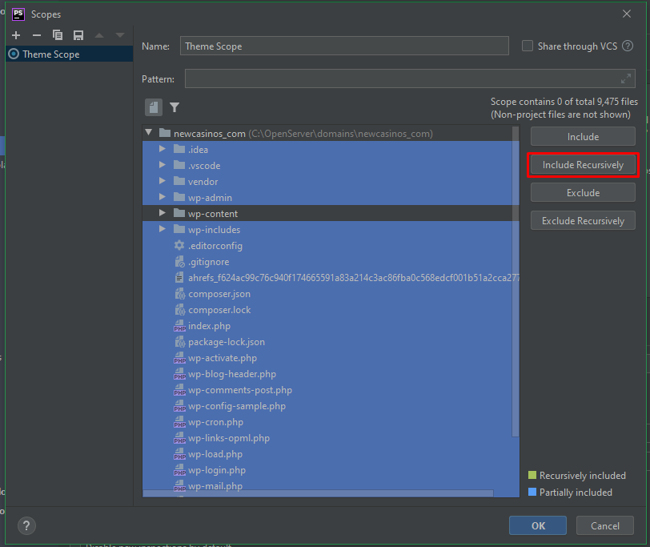   
  
Then select this new created Scope and uncheck it. Select Coding Standards as PSR12   
   
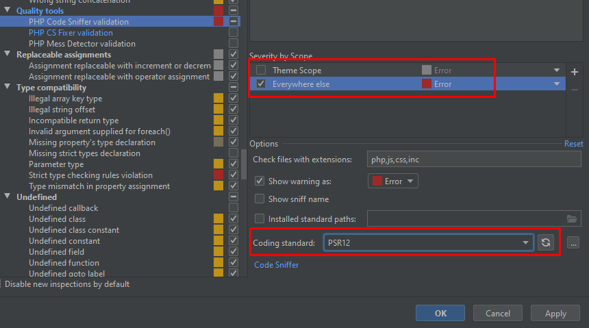   
   
Now when you open an PHP file you can press ALT+Enter and select PHP Code Beautifier and Fixer and it will fix most of
the errors, rest of them you have to fix manually.   
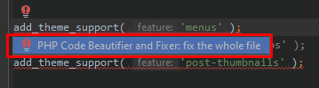   

##### VSCode
In VSCode install two extensions 'phpcs' and 'phpcbf'   
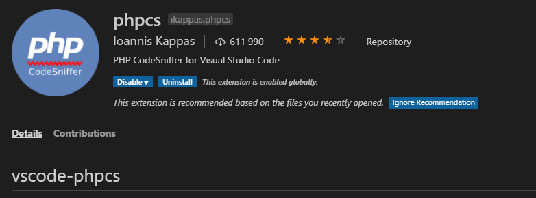   
   
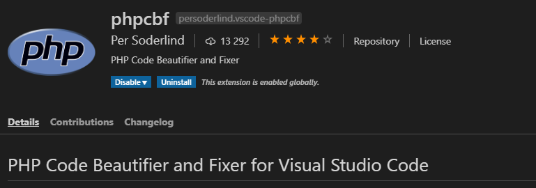   
   
Add this settings (in 'phpcs.ignorePatterns' paste what files you do not need to scan) and '"phpcbf.onsave": true,'
is optional if you want to reformat you code on save     
```
{
    "phpcs.executablePath": "vendor\\bin\\phpcs.bat",
    "phpcs.standard": "PSR12",
    "phpcs.ignorePatterns": [
        "./wp-includes",
        "./wp-content/plugins",
        "!./wp-content/plugins/MY_CUSTOM_PLUGIN"
    ],
    "phpcbf.executablePath": ".\\vendor\\bin\\phpcbf.bat",
    "phpcbf.onsave": true,
    "phpcbf.standard": "PSR12"
}
```

#### ESLint
1. Add ESLint config to your Wordpress theme `wp-content/themes/<YOUR_THEME>`. You will need `.eslintrc` and `.eslintignore`
1. Install ESLint global `npm i -g eslint`   
1. Install ESLint local in project `npm i -D eslint`   
1. Install ESLint Wordpress config `npm i -D @wordpress/eslint-plugin`   
1. In file `.eslintignore` write what files you need to ignore, it should be all third party plugins and autogenerated .js files   
1. Enable ESLint plugin in your IDE or editor:   
In PHP storm "Settings -> type eslint and select Automatic ESLint configuration"   
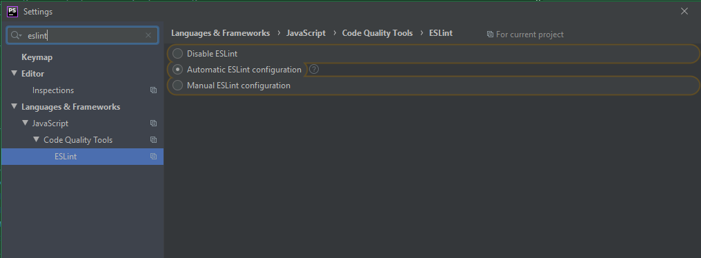   
   
1. In VSCode "Extensions -> ESLint" and install it   
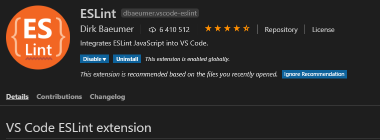

#### StyleLint
1. Add StyleLint config `.stylelintrc` to your Wordpress theme `wp-content/themes/<YOUR_THEME>`.
1. Install StyleLint global `npm i -g stylelint`   
1. Install StyleLint local `npm i -D stylelint`
1. Install packages for stylelint wordpress, scss, order   
`npm i -D stylelint-config-wordpress`   
`npm i -D  stylelint-scss`   
`npm i -D stylelint-order`   
1. in the end of `.stylelintrc` fill "ignoreFiles" array
1. Enable Stylelint plugin in your IDE or editor:   
In PHP storm "Settings -> type stylelint and Enable it"   
in VSCode "Extensions -> stylelint-plus"   


### Using in IDE
There are several ways to use linters, run linters manually in console, set up watchers or npm scripts

#### Console
1. Simply run in console command `eslint <PATH_TO_FILE>`, you can add key `--fix` to fix everything that can be fixed automatically   
1. You can add commands to package.json    
```
"scripts": {   
  "lint:js": "eslint <PATH_TO_FILE_OR_FOLDER> --fix",
  "lint:scss": "stylelint <PATH_TO_FILE_OR_FOLDER> --fix"
},
```   
and then you need just run in console `npm run lint:js`   

#### PHP Storm
1. In PHPStorm after you are enable ESLint and Stylelint you will see errors in files marked with red lines
1. By right mouse click in file you can call ESLint fix command   
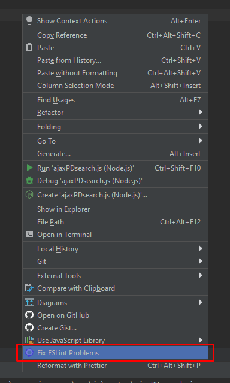
1. To add Stylelint in context menu you will need to set up External Tools:   
Go to Settings -> Tools -> External Tool -> add new tools, fill all fields according to screenshot and you will se it in context menu   
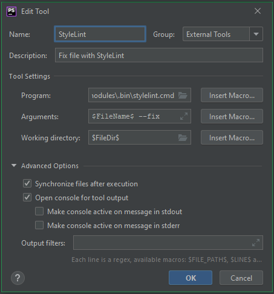 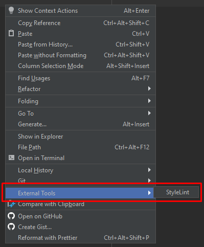
1. You can also create a file watcher and ESLint/Stylelint will work when you save file (NOTE! not really recommended in terms of IDE performance)  
Here's how to create watcher:   
Go to Settings -> Tools -> File Watchers -> add new Custom watcher; Fill all the fields   
Program set to `<PATH_TO_YOUR_PROJECT>\wp-content\themes\<YOUR_THEME_NAME>\node_modules\.bin\eslint` or stylelint   
Working Directory set to `<PATH_TO_YOUR_PROJECT>\wp-content\themes\<YOUR_THEME_NAME>`   
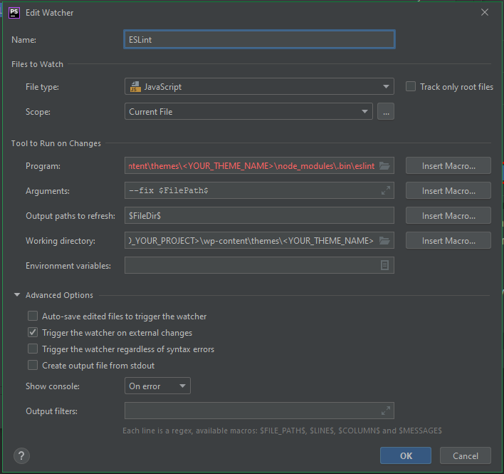   
> **NOTE!!! For Stylelint - Working Directory is not necessary, but important to fill Environment variables to COMPILE_PARTIAL=true**   

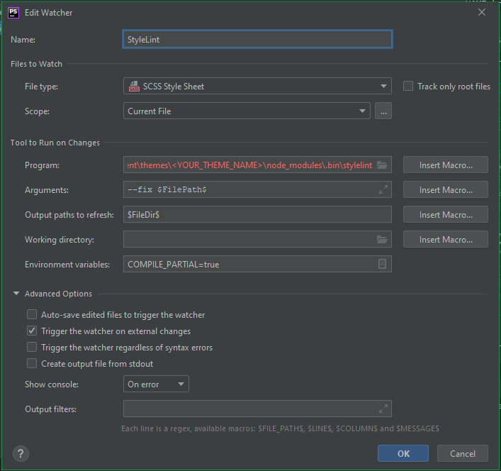   

#### VSCode
1. ESLint - if in VSCode workspace you have load all project(not only theme folder), then for proper ESLint work you
need to add `.vscode` folder and `settings.json` for current project and set there eslint working directories path
```
{
     "eslint.workingDirectories": [
         "./wp-content/themes/<PATH_TO_THEME_OR_ESLINT_CONFIG>/"
     ]
}
```
1. Go to Settings -> ESLint and enable plugin and turn on "Auto Fix On Save" option, if you want to use it.   
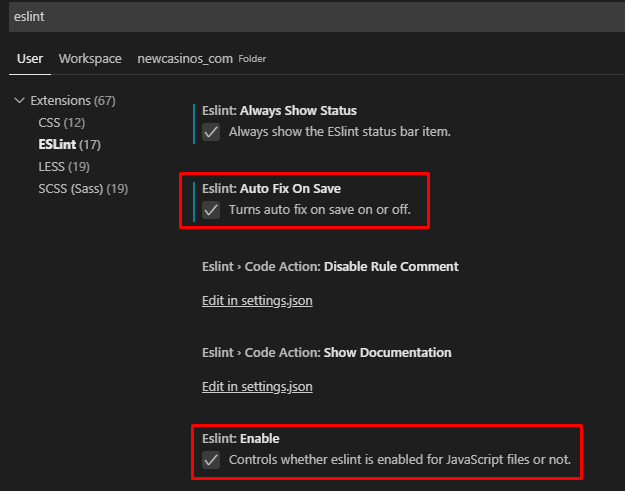   
   
2. For Stylelint go to Settings -> type stylelint and Enable option `stylelint.autoFixOnSave`   
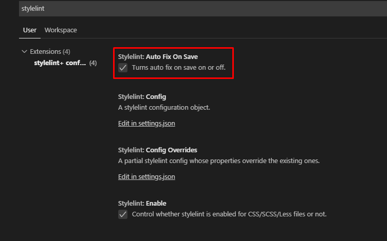   
