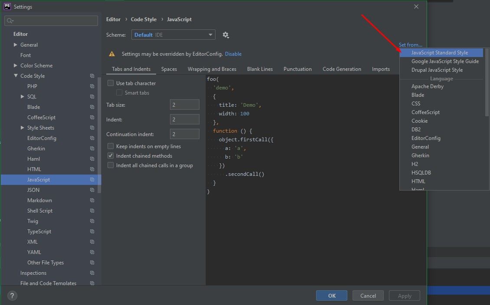
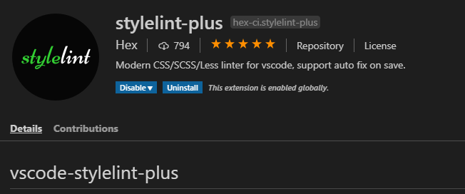

# Coding Standards at Catenamedia/Hyperion
This document defines coding standards that is going to be utilized when writing PHP, JavaScript,
CSS/SCSS code at Catenamedia/Hyperion.

## What's covered with this document?
* Definition of coding standards for each language
* How to use standards with legacy code
* Instructions how to add CodeSniffer and Linters into .ide
* Config files

## PHP Coding standards

### Coding style, formatting, and naming
Coding standards for all PHP code written at Catenamedia/Hyperion should follow PSR-1 and PSR-12 standards. The list of things
that should be compliant to PSR standards:
* PHP Tags
* Character encoding
* Code lines and indenting
* Namespaces and auto-loading
* Class, constants, properties, and methods naming
* Keywords and types
* Usage of traits
* Closures
* Methods and functions
* Control structures (if, switch, while, for, foreach, try-catch)
* Ternary operators

Complete standards can be found here:
* https://www.php-fig.org/psr/psr-1/
* https://www.php-fig.org/psr/psr-12/

## JavaScript Coding Standards
Coding standards for all JavaScript code written at Catenamedia/Hyperion should follow JavaScript Standard Style
https://standardjs.com/   
It's popular and simple set of JavaScript rules with best practises and used by lots of software companies and projects   
> **Note**   
> This Standards covered ES6 syntax, so you might need to add Babel into your Webpack/Gulp tasks

## CSS/SCSS Coding Standards   
Since we do not write pure CSS and all styles are in SCSS we will follow Sass Guidelines https://sass-guidelin.es/,
but with next exceptions:   

* **Indents** - we will use four (4) spaces indents instead of two (2)
* **Quotes** - we will use double quote in SCSS, it's more common to ue double quotes in CSS/SCSS and on other
hand to separate it from JS (were we use single quotes) and to avoid mixing quotes or escaping characters in case
if string contains one or several single quotes.
* **ZEROS in Numbers** - Numbers should NOT display leading zeros before a decimal value less than one.
```scss
// Yep
.foo {
  opacity: .5;
}

// Nope
.foo {
  opacity: 0.5;
}
```
* **Colors** - Colors should always be in Hexadecimal notation (lowercase and shortened), and rgba() 
if requires alpha chanel
* **Declaration Sorting** - should be ordering by type (position, display, colors, font, miscellaneous…).
This will be handled by npm package `stylelint-rational-order`
* **Selector Nesting** - Recommended to pay attention to this section https://sass-guidelin.es/#selector-nesting
Strongly not recommended use following constructions:
```scss
.foo {
  &-bar {
    color: red;
  }
}
```
As it said in guidelines:
> The problem with selector nesting is that it ultimately makes code more difficult to read. One has to mentally
> compute the resulting selector out of the indentation levels;
> it is not always quite obvious what the CSS will end up being.
* **Extends, Mixins, Conditions, Loops, etc...** - Sass provides a lot of different possibilities and complex solutions.
General recommendation is try to avoid using a lot of these possibilities.
Write your code for maximum clarity, not your personal preference of how to get clever within the spec.
(We do not write our own framework and your code will be maintaining by a lot's of others developers)

## How to use standards with legacy code
After you will add all configs for Code Standards and Sniffer/Linters(instructions below) you will probably have bunch
of errors in bunch of files. Your working process will be next:   
When you start working on a file, you need to run this file with auto fix Sniffer/Linter then fix manually all errors
that cannot be fixed automatically. Make sure that fixed code work properly. Then make a separate commit of this file.

## CodeSniffer and Linters 
To help following all standards we will use CodeSniffer and Linters to check code and fix elementary mistakes

### Editorconfig
Editorconfig defines a standard code formatting style guide among all the IDEs and editors used within a team of developers   
Add `.editorconfig` file to root of your project(that open in your IDE, if you're open only theme folder, then it should 
be in the root of your theme) and enable editorconfig plugin in IDE or editor that you use.   
In VSCode go to Extensions search for EditorConfig -> install it   
   
   
   
In PHP Storm go to Settings -> Plugins search for EditorConfig and enable or install   
   

   
### PHP Code_Sniffer
- Requires installed Composer https://getcomposer.org/   
   
Add `composer.json` to the root of you project and run in console `composer install`.   

#### PHPStorm
In PHPStorm be sure that executable path to PHP Code Sniffer and Code Beautifier is set up correctly   
Go to **Settings -> Languages & Frameworks -> PHP -> Quality Tools -> Code Sniffer**   
Should be set to `<YOUR_PROJECT>\vendor\squizlabs\php_codesniffer\bin\phpcs.bat and phpcbf.bat`   
   
   
   
Then Go to **Settings -> Editor -> Inspections -> PHP -> Quality Tools -> Enable PHP Code Sniffer Validation**   
Severity - set to Errors   
In All Scopes you need to change **Edit Scope Order** and add new where you have to select all files that do not have to be
scanned with sniffer, this is everything except theme and custom plugins, select folders and add them
as 'Include Recursively'   
   
   
   
Then select this new created Scope and uncheck it.   
In "Everywhere else" scope, fill needed file extensions and select Coding Standards as PSR12   
   
   
   
Now when you open an PHP file you can press ALT+Enter and select **PHP Code Beautifier and Fixer** and it will fix most of
the errors, rest of them you have to fix manually.   
   
   

#### VSCode
In VSCode install two extensions 'phpcs' and 'phpcbf'
   
   
   
   
   
Add this settings   
```
{
    "phpcs.executablePath": "vendor\\bin\\phpcs.bat",
    "phpcs.standard": "PSR12",
    "phpcs.ignorePatterns": [
        "./wp-includes",
        "./wp-content/plugins",
        "!./wp-content/plugins/MY_CUSTOM_PLUGIN"
    ],
    "phpcbf.executablePath": ".\\vendor\\bin\\phpcbf.bat",
    "phpcbf.onsave": true,
    "phpcbf.standard": "PSR12"
}
```
In **"phpcs.ignorePatterns"** paste what files you do not need to scan   
In **"phpcbf.onsave": true,** this is optional if you want to reformat you code on save   

### JavaScript Standard Style
Do not require any specific config files, so you can follow usage instruction from their site
https://standardjs.com/index.html#install
* Install standard package global `npm install standard --global`   
* Install standard package locally `npm install standard -D`   
* Add ignore paths and files to your package.json 
    ```
    "standard": {
        "ignore": [
          "node_modules/**",
          "**/vendor/**.js"
        ]
      }
    ```
* Simply run in console command `standard <PATH_TO_FILE>` to see all errors in console
or add key `--fix` to fix everything that can be fixed automatically   
* You can add commands to package.json    
```
"scripts": {   
  "lint:js": "standard <PATH_TO_FILE_OR_FOLDER> --fix",
},
```   
and then you need just run in console `npm run lint:js` to check all files   

### StyleLint
* Add StyleLint config `.stylelintrc` and `.stylelintignore` to your Wordpress theme `wp-content/themes/<YOUR_THEME>`.
* Install StyleLint global `npm i -g stylelint`
* Install StyleLint local `npm i -D stylelint`
* Install packages for stylelint   
`npm i -D stylelint-config-sass-guidelines`   
`npm i -D stylelint-config-recommended-scss`   
`npm i -D stylelint-scss`   
`npm i -D stylelint-order`   
`npm i -D stylelint-config-rational-order`   
* In file `.stylelintignore` add what files/folders you need to ignore,
it should be all third party plugins and autogenerated .css/scss files   
* Simply run in console command `stylelint <PATH_TO_FILE>` to see all errors in console
or add key `--fix` to fix everything that can be fixed automatically   
* You can add commands to package.json    
```
"scripts": {   
  "lint:css": "stylelint <PATH_TO_FILE_OR_FOLDER> --fix",
},
```   
and then you need just run in console `npm run lint:css` to check all files   

### Add Linters to IDE

#### PHP Storm

##### JavaScript Standard
* To use JavaScript Standard in PHPStorm you still need to install ESlint
* Install ESLint global `npm i -g eslint`   
* Install ESLint local in project `npm i -D eslint`  
* In the **Settings/Preferences** dialog, go to **Editor | Code Style | JavaScript**
* On the Code Style. JavaScript page that opens, click Set from, and then select Predefined Style | JavaScript Standard
Style. The style will replace your current scheme.

* Enable Linting with Standards via ESLint
* In the **Settings/Preferences** dialog, go to **Languages and Frameworks | JavaScript | Code Quality Tools | ESLint**.
* On the **ESLint** page that opens, select **Manual ESLint configuration** and specify the location of the `standard`
package in the **ESLint Package** field.

Now IDE should mark errors in .js files   

##### JavaScript Standard auto Fix
To run JS Standard autofix on specific file, you can use command from context menu
   

   
Or set up watcher to run autofix on file save
* In the **Settings/Preferences** dialog, go to **Tools | File Watchers**
* Add new <Custom> watcher, fill Name, File Type, path to program(in our case it's node_module standard),
Arguments and Output path   
   


##### StyleLint
* Enable Stylelint plugin go to **Settings/Preferences** dialog,
go to **Languages & Frameworks | Style Sheets | Stylelint** and Enable it"   
Now IDE should mark errors in your style files

##### StyleLint auto Fix
* To add Stylelint in context menu you will need to set up External Tools:   
Go to **Settings -> Tools -> External Tool -> Add new tools**,
fill all fields according to screenshot and you will se it in context menu
   
 

Or set up watcher to run autofix on file save  
* In the **Settings/Preferences** dialog, go to **Tools | File Watchers**   
* Add new <Custom> watcher, fill Name, File Type, path to program, Arguments and Output path   
* Program set to `<PATH_TO_YOUR_PROJECT>\wp-content\themes\<YOUR_THEME_NAME>\node_modules\.bin\stylelint`      
> Important to fill Environment variables to COMPILE_PARTIAL=true   
   
   

#### VSCode

##### JavaScript Standard
To run autofix on file save in VSCode you will need ESLint and some additional ESLint Configs and plugins   
* Install next packages 
`npm i -D eslint eslint-config-standard eslint-plugin-standard eslint-plugin-promise eslint-plugin-import eslint-plugin-node`
* Add `.eslintrc` into yor theme
* If in VSCode workspace you have load all project(not only theme folder), then for proper ESLint work you
   need to add `.vscode` folder and `settings.json` for current project and set there eslint working directories path
   ```json
   {
        "eslint.workingDirectories": [
            "./wp-content/themes/<PATH_TO_THEME_OR_ESLINT_CONFIG>/"
        ]
   }
   ```
* In VSCode **"Extensions -> ESLint"** and install it   

* Add to VSCode  settings.json
   
    ```json
    {
        "[javascript]": {
            "editor.defaultFormatter": "dbaeumer.vscode-eslint",
            "editor.codeActionsOnSave": {
                "source.fixAll.eslint": true
            }
        }
    }
    ```
> **NOTE**   
> ESLint is required only for auto formatting .js files on save. If you do not need this feature you can use 
> Standard styles rule checking and autofix from console

##### StyleLint
* Install and enable stylelint extension **"Extensions -> stylelint-plus"**   

* Enable option `stylelint.autoFixOnSave`

       
